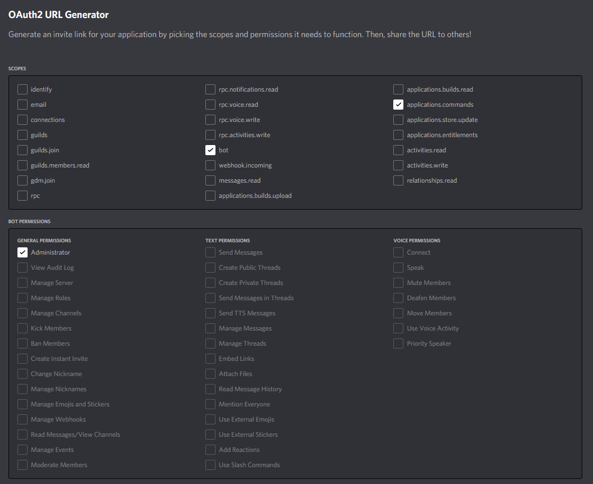

# delw-v2
Новая версия бота HackerCom.


Перед этим, вам нужно иметь [Python](https://www.python.org/downloads/)

Настраиваем config.py под себя

Приглашаем бота, используя это:

<details>
  <summary>Параметры OAuth2 для бота</summary>
  
</details>


Установка библиотек и запуск бота:
  ```cmd
  pip install -r requirements.txt
  python bot.py
  ```
